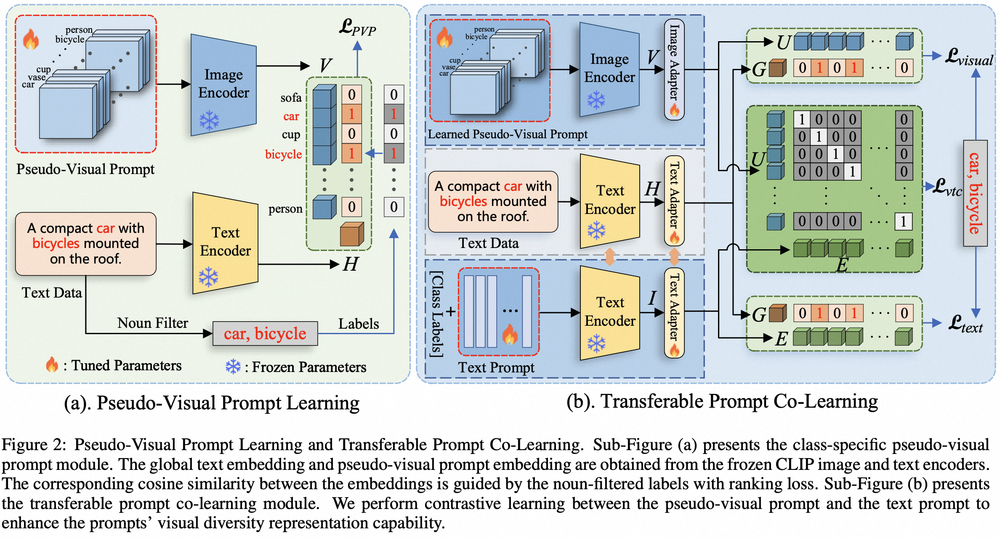

# TAI++: Text as Image for Multi-Label Image Classification by Co-Learning Transferable Prompt


## Introduction

This repo officially implements **TAI++: Text as Image for Multi-Label Image Classification by Co-Learning Transferable Prompt**.

[[Paperswithcode](https://paperswithcode.com/paper/tai-text-as-image-for-multi-label-image)] [IJCAI2024]


<center>


Fig.1 Overview of the two stages.
</center>

## Install

The code is based largely on the implementation of [TAI-DPT](https://github.com/guozix/TaI-DPT).


Please follow the steps below to build your environment.

```bash
# Create a conda environment (Omit if you already have a suitable environment)
conda create -n dassl python=3.7
conda activate dassl
conda install pytorch==1.8.0 torchvision==0.9.0 torchaudio==0.8.0 cudatoolkit=11.1 -c pytorch -c conda-forge # torch (version >= 1.7.1)

# Clone this repo
git clone https://github.com/Jinx630/Pseudo-Visual-Prompt.git
cd Pseudo-Visual-Prompt/pvp_pretrain

# install Dassl
cd Dassl.pytorch-master/
# Install dependencies
pip install -r requirements.txt
# Install this library (no need to re-build if the source code is modified)
python setup.py develop

cd ..
# Install CLIP dependencies
pip install -r requirements.txt

# Finished
```

#### 1. **Stage 1:**
```
cd pvp_pretrain

# Generate pretrain and finetune training data 
sh generate_data.sh

# Pretrain pseudo-visual-prompt (first stage)
sh pretrain.sh
```

#### 1. **Stage 2:**
```
cd pvp_finetune

# Co-learn pseudo-visual-prompt and text prompt (second stage)
sh finetune.sh
```